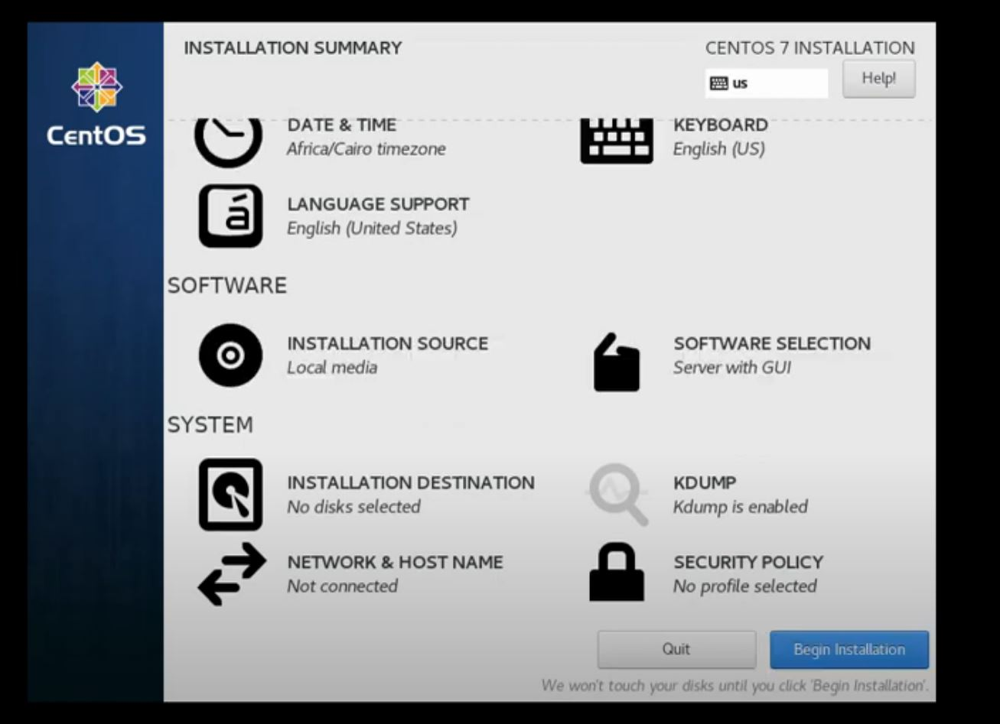
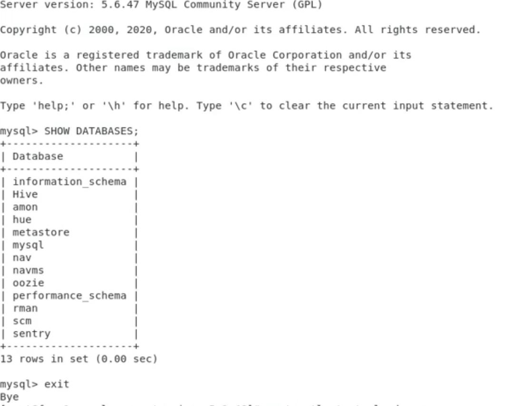
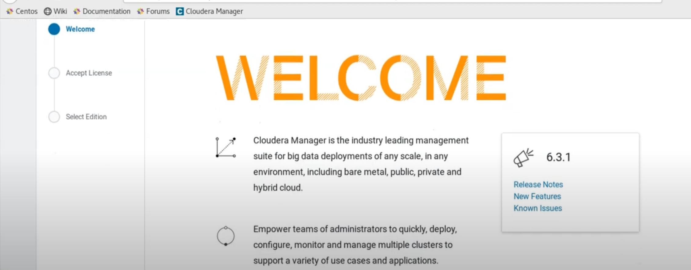
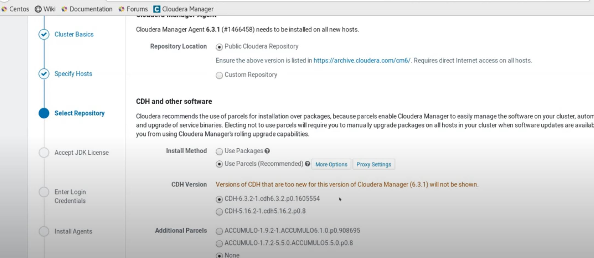
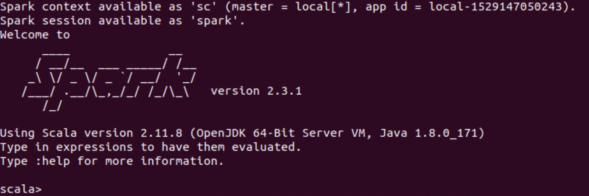
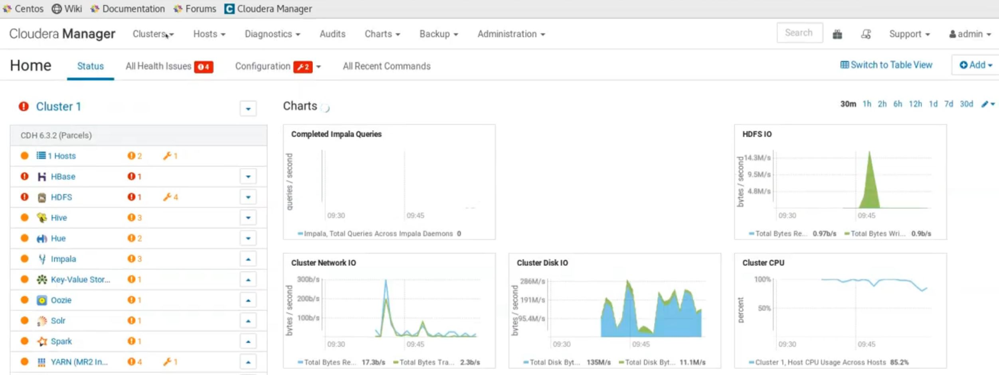

# Deploy a Apache Hadoop Big Data Cluster Server using Cloudera CDH 6.x on Docker Container
*Written by Kerem ÇELİKER*
- Twitter: **`@CloudRss`**
- Linkedin: **`linkedin.com/in/keremceliker`**
- Blog: **`www.keremceliker.com`**

Big data is an architecture developed to analyze large-scale data first and then draw meaningful results from this the large-scale data, irregular data we have. At the main of this architecture is Hadoop. 

Firstly, there are many big data services or products depending on the type of data we will store and the analysis processes we want to perform on it.

These services, for example have different task responsibilities, such as Apache Spark, Kafka, Impala,Hbase,Hdfs. But when it works as a whole together, it's the services that lead us and comes to the definitive conclusion

Cloudera offers a complete Big Data platform for Customers. Cloudera lets us set up and manage Hadoop and Big Data management with a "Hybrid-Cloud or Containers (such as Kubernetes,OpenShift or Docker)" Centralized and Easy Platform with Open-Source products developed

Our goal in this article is to Demo-Test How We can Quick-Deploy a Apache Hadoop Cluster using Cloudera.


**The Hadoop cluster we will set up is briefly as follows:**

*I didn't mention the all details because it's only POC Demo.

-	2 x NameNode will be redundant as Master & Slave.
-	1 x Management Node
-	4 x DataNode

> Don't Forget put Architectural Image to here !!! <<<<<<< !!!


## Pre-Requisites

1.1) **Introductions:**

- All Cloudera CDH packages will download on the node we will use as Cloudera Manager.
- Nice to have RedHat Linux or Centos Linux 
- Preferably must run on the VMware vSphere 7 or VCF 4
- Docker Container latest version is compatible with Cloudera CDH (Optional-If you wish)
- Installed to be Oracle JDK 1.8 on Linux/Docker


1.2) **Links for Pre-Requisites:**

-	Install latest version of  [Docker Images Files for Cloudera CDH](https://hub.docker.com/r/cloudera/sandbox-cdh/tags)
  -	Install latest version of [VMware vSphere ESXi 7 or VCF4](https://www.vmware.com/go/cloudfoundation-download)
  -	Install latest version of  [Docker CE](https://docs.docker.com/install/linux/docker-ce/)
  - Install latest version of [RedHat Linux or Centos Linux](http://isoredirect.centos.org/centos/7/isos/x86_64/)
  - Install latest version of Cloudera CDH [Cloudera Packages for Hadoop](https://archive.cloudera.com/cm6/6.3.1/)
  - Install latest version of [Oracle JDK 1.8](https://www.oracle.com/technetwork/java/javase/downloads/jdk8-downloads-2133151.html)


## Infrastructure Diagram on ?????? <<<<<< !!!


1- **Install Linux OS on VMware 7 or VCF 4 (CloudFoundation)**


2- **Prepare Linux OS Nodes for Hadoop Setup by Cloudera CDH**
```
Set SELINUX=disabled or Set=Permissive in the /etc/selinux/config

Remove IPv6's 
Remove UUID 
Onboot=yes
bootproto=static
IPADDR=192.168.1.10
DNS1=8.8.8.8
DNS2=4.4.4.4
GATEWAY=192.168.1.254
NETMASK=255.255.255.0

[root@keremdevops-]# systemctl disable firewalld
[root@keremdevops-]# systemctl stop firewalld


Set hostname by NMTUI or vi /etc/hosts
**Clear All Entries on Host File
**Set IP Address Management-Kerem01.hadoop.local Management-Kerem01
**Set Node IP Address DN-Kerem01.hadoop.local DN-Kerem01
**Set Node IP Address DN-Kerem02.hadoop.local DN-Kerem02
**Set Node IP Address DN-Kerem03.hadoop.local DN-Kerem03
**Set Node IP Address DN-Kerem04.hadoop.local DN-Kerem04

[root@keremdevops-]# service network restart
[root@keremdevops-]# yum install net-tools
[root@keremdevops-]# yum -y install ntp
[root@keremdevops-]# yum -y install httpd

[root@keremdevops-]# systemctl start ntpd
[root@keremdevops-]# systemctl enable ntpd
[root@keremdevops-]# systemctl start httpd
```




3- **Create a Docker Container on Linux VM for Boot-Strap Process**
```
$ sudo apt-get update
$ sudo apt-get install docker-ce docker-ce-cli containerd.io
$ apt-cache madison docker-ce
$ sudo apt-get install docker-ce=<VERSION_STRING> docker-ce-cli=<VERSION_STRING> containerd.io (Choose 5.18 or 5.19, It's up to you)
$ sudo docker run hello-world (for Verify to correctly running Docker Contaianer Services)

```

4- **Install MySql Community Release & Connector Java on Linux VM**
```
[root@keremdevops-]# wget https://downloads.mysql.com/archives/c-j/...tar.gz
[root@keremdevops-]# wget https://dev.mysql.com/downloads/mysql/5.7.html?os=src

[root@keremdevops-]# systemctl start mysqld
[root@keremdevops-]# systemctl enable mysqld

Don't Forget Login MySQL Test Access !

[root@keremdevops-]# mysql -u root -p
```




5- **Install the Hadoop Cluster by Cloudera CDH**
```
We use one of the nodes as a database server. The database can be oracle, PostgreSql, or MySql. 
My preference is MySql but you can use it on PostgreSQL,MongoDB,MariaDB


[root@keremdevops-]# yum install wget >>> Sometimes the operating system wants us to joke and then use it :-)
[root@keremdevops-]# wget https://archive.cloudera.com/cm5/installer/latest/cloudera-manager-installer.bin
[root@keremdevops-]# chmod u+x cloudera-manager-installer.bin
[root@keremdevops-]# sudo ./cloudera-manager-installer.bin for Install Cloudera Manager packages from the Internet
[root@keremdevops-]# sudo ./cloudera-manager-installer.bin --skip_repo_package=1 <<< If you want to skip repos, just use it then 
```
> Why would you like to skip ??  => If you re behind firewall with no internet access ! :-)

6- **Access the Hadoop Namenode via Cloudera Manager**



```
[root@keremdevops-]# sudo systemctl start cloudera-scm-server
http://localhost:7180 for Login to Cloudera Manager Dashboard
Username: Admin | Password: Admin
```
7- **Final Configuration and Start Hadoop Sandbox Cloudera CDH**

- Cloudera agents must be installed on all Hadoop Nodes to be included in the Cluster by Cloudera Manager 
- In the other 8 steps from Cloudera Manager as the follows image below, the required configurayon information is filled in according to the customer's request and the installation is completed

At this point deployment of all services will complete with a final configuration and deployment phase followed by the first run command, thus making all services active.




 
8- **Download Test-Big Data Database & First-Initialization Apache Spark on Cloudera Hadoop Cluster** 
```
[root@keremdevops-]# sudo yum install epel-release 
[root@keremdevops-]# sudo yum install p7zip p7zip-plugins
[root@keremdevops-]# wget https://archive.org/download/stackexchange/vi.stackexchange.com.7z
[root@keremdevops-]# spark-submit --packages com.databricks:spark-xml_2.10:0.3.3 --master local[*] post-to-hdfs.py file:///home/cloudera/Posts.xml
```

```
Upload the All Result file into the root of HDFS 

[root@keremdevops-]# hdfs dfs -cp results/
[root@keremdevops-]# pyspark
```



## Finally, you have a fully functional, a Hadoop Cluster installed using Cloudera CDH !





